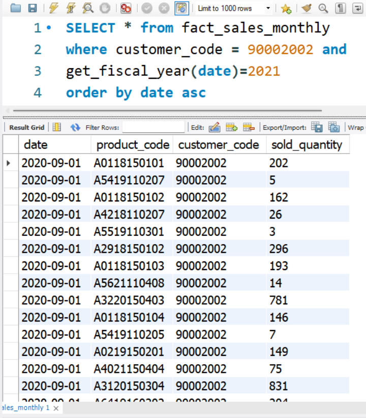
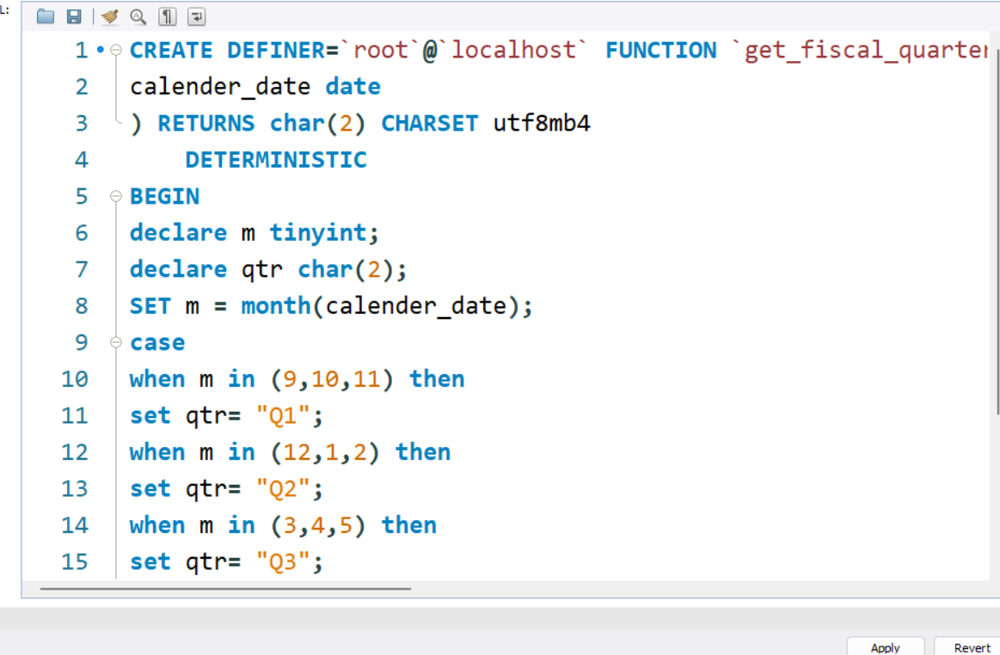

# User Defined Functions

## Objective

Learn how to create and use User Defined Functions (UDF) in MySQL.

---

## Function Used

```sql
get_fiscal_year(date)
```

This function returns the fiscal year corresponding to a given date.

---

## Query

```sql
SELECT *
FROM fact_sales_monthly
WHERE customer_code = 90002002
AND get_fiscal_year(date)=2021
ORDER BY date ASC;
```

---

## Output

The query returns sales records belonging to customer 90002002 for fiscal year 2021.

---

## Screenshots

See screenshots folder for query and output images.
## Output Screenshot


## User Defined Function: get_fiscal_quarter()

### Query

```sql
SELECT *
FROM fact_sales_monthly
WHERE customer_code = 90002002
    AND get_fiscal_year(date)=2021
    AND get_fiscal_quarter(date)="Q4"
ORDER BY date ASC;
```

### Output Screenshot



### Key Learnings

- Created a User Defined Function using CASE.
- Used MONTH() to determine fiscal quarter.
- Combined two User Defined Functions in the WHERE clause.
